# sql2puml
Convert SQL DDL to Markdown in plantuml puml format

# Invocation/Execution
awk -f sql2puml.awk inputfile > outputfile

# Example
## Example Input
```
CREATE TABLE table4_3_cols_and_pk (id INT PRIMARY KEY, firstname VARCHAR(100), lastname VARCHAR(100) );
```

## Example Output
```
left to right direction
skinparam roundcorner 5
skinparam linetype ortho
skinparam shadowing false
skinparam handwritten false
skinparam class {
 BackgroundColor white
 ArrowColor #2688d4
 BorderColor #2688d4
}
!define primary_key(x) <b><color:#b8861b><&key></color> x</b>
!define foreign_key(x) <color:#aaaaaa><&key></color> x
!define column(x) <color:#efefef><&media-record></color> x
!define table(x) entity x << (T, white) >>
table( table1_single_column ) { 
column ( id ): INT
}

table( table4_3_cols_and_pk ) { 
primary_key ( id ): INT
column ( firstname ): VARCHAR(100
column ( lastname ): VARCHAR(100)
}

```
## Example PUML rendered

```puml
@startuml
left to right direction
skinparam roundcorner 5
skinparam linetype ortho
skinparam shadowing false
skinparam handwritten false
skinparam class {
 BackgroundColor white
 ArrowColor #2688d4
 BorderColor #2688d4
}
!define primary_key(x) <b><color:#b8861b><&key></color> x</b>
!define foreign_key(x) <color:#aaaaaa><&key></color> x
!define column(x) <color:#efefef><&media-record></color> x
!define table(x) entity x << (T, white) >>

table( table4_3_cols_and_pk ) { 
primary_key ( id ): INT
column ( firstname ): VARCHAR(100
column ( lastname ): VARCHAR(100)
}
@enduml

```

